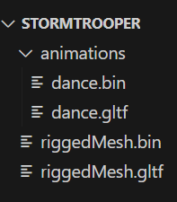


# AssetPipline

The AssetPipeline is a standalone command line tool that will process your assets for use by TheForge and is capable of processing:

 - Animations: Input GLTF files
 - Meshes: Input GLTF files
 - Textures: Input PNG/JPG/DDS/KTX files

# Building AssetPipeline

AssetPipeline can be built on the following platforms:

 - **Windows**
	 - Build using the VisualStudio solution found at `The-Forge\Common_3\Tools\AssetPipeline\Win64\AssetPipline.sln`
	 - Once built, the executable can be found at `The-Forge\Common_3\Tools\AssetPipeline\Win64\x64\<Configuration>\AssetPipelineCmd.exe`
 - **Linux**
	 - Build using the Codelite workspace found at `The-Forge/Common_3/Tools/AssetPipeline/Linux/AssetPipeline.workspace`
	 - Once built, the executable can be found at `The-Forge/Common_3/Tools/AssetPipeline/Linux/Bin/<Configuration>/AssetPipelineCmd`
 - **MacOS**
	 - Build using the xcode project found at `The-Forge/Common_3/Tools/AssetPipeline/Apple/AssetPipelineCmd.xcodeproj`
	 - Once built. the executable can be found at `The-Forge/Common_3/Tools/AssetPipeline/Apple/Bin/<Confugration>/AssetPipelineCmd`

# Running AssetPipeline

## **Processing Animations**

Run the following command to process animations for use in The-Forge:
`./AssetPipelineCmd.exe -pa --input <relative\path\to\input\folder> --output <relative\path\to\output\folder> --force --recursive`

**Instructions**

 - Animated objects must be in GLTF
 - The containing folder should be the name of the animated object
 -  The containing folder must contain a single GLTF file named riggedMesh.gltf with the associated riggedMesh.bin file.
		 - These files must contain all the skeletal data in the bind pose with no animation data and no additional data that does not relate to the skin or skeleton
 - The containing folder must contain a subfolder named "animations" 
		 - Each animation must have a separate gltf and bin file containing only the animation data without any extra skin/mesh data.
 - Example structure:
		 

## **Processing GLTF**

Run the following command to process GLTF meshes for use in The-Forge:

    ./AssetPipelineCmd.exe -pgltf --input <relative\path\to\input\folder> --output <realtive\path\to\output\folder>

Specify the `--hair` option to process the mesh as a hair mesh.
Specify the `--optimize` option to enable all supported mesh optimization techniques. 
Individual optimization can also be specified with the following options:

 - `--optimizecache`
 - `--optimizeoverdraw`
 - `--optimizefetch`

Specify the `--meshlet` option to enable meshlet generation.

## **Processing Textures**

Run the following command to process textures for use in The-Forge:

    .\AssetPipelineCmd.exe -pt --input-file <relative\path\to\input\file.extension> --output <realtive\path\to\output\folder> 

**Output Container**
Specify the `--out-dds` option to process the texture using a DDS container for the output.
Specify the `--out-ktx` option to process the texture using a KTX container for the output. 
If no option is specified, the default option chosen will be `--out-dds`

**Input format**
By default, AssetPipeline will use the file extension to determine the file format. If required, the following options can be used to explicitly specify the input format:  `--in-png`, `--in-jpg`, `--in-ktx`, `--in-dds`

If the input file is a PNG or JPG color space of the input image is assumed to be in sRGB. If required, the following option can be used to explicitly specify that the input is in linear color space. `--in-linear`

**Compression**
AssetPipeline supports compression using ASTC or BC. To apply compression during processing specify one of the following options:

 - `--astc`
 - `--bc`

## **Processing zip files**

Run the following command to zip multiple files for use in The-Forge:

    .\AssetPipelineCmd.exe -pwza --input <relative\path\to\input\folder> --output <relative\path\to\output\folder> --name ZipFileName.buny`

   

## **Common options**

    -h | --help
Print usage information

     --quiet
Print only error messages

     --force
Force all assets to be processed even if the output already exists.

## **Logs**

A log file for your latest AssetPipeline command execution can be found at the same path as the executable. 

